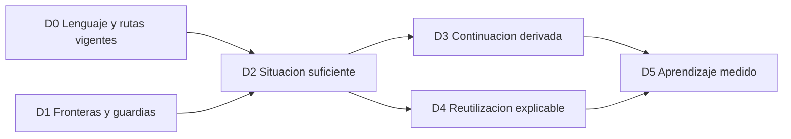

# Plan de evolución del sistema

**Plan vigente · 09/10/2026.** Desarrolla [SISTEMA.md](SISTEMA.md) mediante recorridos completos y conserva [AGENTE.md](AGENTE.md), [OPERACION.md](OPERACION.md) y [APLICACION.md](APLICACION.md). Perfiles de búsqueda está implementado y se comprueba como producto; no autoriza trabajo de empleo. Las demás evoluciones conservan su condición de propuesta.

## Entrega 1.0 · 09/10/2026

La petición humana autoriza preparar y publicar la versión 1.0 en jaimeacena/stubbs-jobs. Se conservan datos personales e historial local y se publica únicamente la edición genérica comprobada. La identidad estable, el README y las comprobaciones en Windows comparten insumos con el ZIP vacío. La aceptación humana, otros equipos y efectos reales permanecen separados de la validación automática y de plataforma. El alcance de las comprobaciones y sus límites se describe en LIMITES.md; no cambia permisos ni inicia encargos de empleo.

## Corrección de conexiones rotas · 09/10/2026

Se corrigen seis fallos reproducidos: hechos de ofertas antiguas que sobrevivían al reinicio, pérdida de envíos inciertos al reiniciar, identificación incoherente del propietario de un cambio, seguimiento confundido con investigación de preparación, dependencias de pruebas ausentes en el código genérico y saltos de línea de Windows duplicados al construirlo. OPERACION.md concreta el reinicio administrativo; los permisos y el modelo conceptual se conservan. Las regresiones usan datos ficticios y la distribución incluye sus dependencias locales. La aceptación humana y los efectos reales se comprueban por separado.

## Revisión adicional del código · 09/10/2026

Cuatro reproducciones adicionales corrigen conexiones existentes: las operaciones de un lote conservan su contenido original durante el procesamiento; un envío anterior no resuelve un bloqueo nuevo de seguimiento; Deshacer conserva el perfil de un guardado compatible de perfil único; la presentación de salarios interpreta rangos con miles compartidos y unidades mezcladas. No cambian el modelo conceptual, los mínimos ni la autoridad para operaciones de empleo. Las regresiones usan datos ficticios y se comprueban junto a la migración, Excel y el código genérico aislado; la aceptación humana permanece separada.

## Repaso con ojos frescos · 09/10/2026

Tres fallos adicionales reproducidos: la participación demográfica particular debe gobernar la reutilización del género; la vista previa debe contar las revisiones después de completar edición y cambio de base; un recibo antiguo sin paquete no acredita los materiales actuales. Las correcciones aplican los contratos existentes, sin cambiar permisos, paquetes históricos ni datos personales. La terminación exige regresiones, batería completa, migración y Excel ficticios, procedencia común de portable y código genérico, y comparación de archivos protegidos. Implementación, pruebas y aceptación se acreditan por separado; las revisiones anteriores conservan identidad.

## Revisión exhaustiva adicional · 09/10/2026

Se corrigen cinco grupos de fallos reproducidos: cronología de comprobaciones dentro del mismo día y entre zonas horarias, fechas y fuentes inválidas, guardado de perfiles de búsqueda incompletos, tareas bloqueadas sin explicación y representación de salarios con monedas entre cifras o límites de bonus. La cronología se aplica también a decisiones, interfaz, Excel e indicadores antiguos mediante una proyección sin escritura. Los permisos, las copias históricas y el modelo conceptual se conservan. La terminación exige regresiones, batería completa, migración y Excel ficticios con fórmulas, reapertura y vistas, procedencia del código genérico y conservación de archivos protegidos. La aceptación humana y los efectos reales se comprueban por separado.

## Cierre funcional por recorridos completos · 09/10/2026

La ronda de cierre reproduce y corrige una preparación terminada que dejaba otra revisión en cola por sus propios cambios y una ficha que pedía aprobar de nuevo un envío ya autorizado. El propietario conserva su preparación vigente; los cambios humanos posteriores siguen separados. La ficha distingue permiso guardado de envío confirmado. Los recorridos ficticios comprueban guardado y reapertura, criterios y elección, versiones y permisos, tanda original y continuación causal, interrupción y conciliación y recuperación aislada. Se verifican además migración, Excel con fórmulas y reapertura, procedencia genérica y conservación. La aceptación humana y los portales reales se acreditan por separado.

## Perfiles de búsqueda: plan corregido del 08/10

La implementación de perfiles de búsqueda corrige estas fisuras; la aceptación humana y los resultados de empleo se comprueban por separado:

| Fisura | Decisión corregida |
| --- | --- |
| Separar solo los formularios deja encargos y fuentes leyendo la configuración global. | Guardar una copia de los criterios al crear cada búsqueda; utilizarla en captación, incorporación y lectura del agente. |
| Un selector global puede cambiar otra ventana o alterar ofertas previas. | Perfil consultado por ventana; perfil predeterminado persistido mediante una acción distinta. Cada oferta conserva su base de evaluación. |
| Duplicar toda la persona crea idiomas, experiencia y CV contradictorios. | Compartir identidad, experiencia, idiomas, notas de empresas y documentos. Separar únicamente objetivos, condiciones y fuentes. |
| Una matriz de candidaturas por perfil duplica permisos y posibles envíos. | Una vacante y una candidatura; registrar apariciones en varias búsquedas. Cambiar su base de evaluación exige acción expresa con vista previa. |
| Cambiar criterios revoca permisos de ofertas que conservan otra foto. | Comparar el material efectivo de cada oferta; revisar solamente lo que realmente cambia. Renombrar, consultar o eliminar un perfil no altera material. |
| El mínimo y la moneda de búsqueda se cuelan en respuestas personales. | Mínimo propio de cada perfil; salario para formularios y su moneda comunes e independientes. Conservar las huellas de paquetes históricos. |
| El horario guarda instrucciones operativas completas. | Horario e indicaciones adicionales en campos distintos; conservar el texto original en el historial. No convertir prosa ambigua en reglas automáticas. |
| Un bloqueo de una búsqueda impide crear otra diferente. | Distinguir solicitudes por perfil y copia de criterios, manteniendo propiedad, reintentos y guardias de envío. |
| La migración puede inventar las dos estrategias antiguas o su procedencia. | Conservar una copia exacta inicial; crear estrategias históricas solo con operaciones y decisiones acreditadas. No atribuir ofertas antiguas por fecha. |
| Los borradores y Deshacer pueden terminar en otro perfil. | Identificador estable en guardados, conflictos, borradores, intentos y Deshacer. Compatibilidad explícita con instalaciones de un único perfil. |
| La cobertura global reciente y las filas nuevas pueden atribuirse a otra búsqueda. | Contar comprobaciones y apariciones registradas por el encargo; una búsqueda sin hallazgos propios conserva cero. |
| Un feed sin identificador puede adoptar silenciosamente la única búsqueda en curso. | Exigir requestId y searchKey coincidentes en instalaciones con perfiles. El captador produce ambos. |

Orden de aplicación: modelo y escritor; aislamiento de encargos/fuentes/ofertas; selector y borradores; migración aislada y comprobación de preservación; documentación personal y genérica; pruebas completas, Excel ficticio y revisión de la interfaz. Conservar la vista previa existente. No ampliar esta entrega a un intérprete automático de horarios, vigilancia o nuevos modos de envío. La prueba de terminación exige dos perfiles distintos sin contaminación, una oferta compartida sin duplicación, guardias intactas, migración sin pérdidas y resultados de verificación separados de la aceptación humana.

Antecedente: implementación y comprobación automática cerradas el 08/10/2026: modelo/escritor, aislamiento operativo, interfaz/borradores, migración sin pérdidas, documentación y Excel ficticio. La batería del proyecto registra 692 casos Python (691 correctos y una prueba nativa opcional omitida) y 385 de interfaz. El recorrido en navegador integrado conserva borradores independientes y una sola candidatura por oferta. Esto no acredita una búsqueda o envío real, aceptación humana, lector de pantalla, ventana nativa de Windows, otro ordenador ni rendimiento con volumen. Las restantes evoluciones conservan su condición de propuesta.

Antecedente: ampliación del 08/10: eliminación recuperable que retira perfiles del selector y conserva las referencias históricas; recuperación expresa, sin cambiar predeterminado ni devolver permisos. El predeterminado y los perfiles con discovery queued/running no se eliminan. Crear/Duplicar/Renombrar usan vectores con nombre accesible y título; las demás acciones mantienen texto. Cambiar perfil de evaluación pasa a Más acciones, fuera de Condiciones. Verificación del proyecto: 696 casos Python (695 correctos y una omisión nativa opcional), 388 de interfaz, recorrido ficticio de eliminación/recuperación y Excel ficticio con fórmulas/reapertura. Se conservan los límites de aceptación y plataforma anteriores.

Actualización del 09/10: Eliminar usa únicamente una papelera vectorial con nombre accesible y ayuda al pasar el cursor. Conserva la confirmación previa y la recuperación. Se retira Archivar de la interfaz y del escritor; las marcas antiguas se leen por compatibilidad, sin ofrecer esa operación. La comprobación exige cancelar sin efectos, confirmar la eliminación, recuperar el mismo perfil y conservar registro y materiales personales. La evidencia se añade en VALIDACION-APP.md.

## Resultado buscado

Un agente debe reconstruir la situación pertinente, decidir el siguiente paso permitido, recuperar su fundamento y continuar sin duplicar trabajo o efectos. Cada paso deja conocimiento útil y una continuación comprobable. La persona recibe resultados claros y preguntas únicamente cuando su intervención hace falta.

La prioridad es **reducir la reconstrucción necesaria para la siguiente decisión correcta**. Primero conservar precisión, autoridad, propiedad y efectos; después reducir el coste completo de leer, actuar, comprobar y retomar. La interfaz y el agente comparten significado, con distinto detalle.

La torre ordena responsabilidades; este plan ordena dependencias y evidencia. Los IDs D0–D5 conservan continuidad con el plan anterior. Los detalles actuales de presentación pertenecen a APLICACION; las comprobaciones fechadas pertenecen a su registro de validación. No hay otra lista de encargos operativos en este documento.

## Diagnóstico de la lectura actual

| Fricción observada en documentos o código | Consecuencia | Respuesta propuesta |
| --- | --- | --- |
| Modelo y plan combinaban reglas vigentes con añadidos de fechas sucesivas. | El agente debe resolver qué versión de una frase sigue aplicándose. | Consolidar presente y enlazar contrato, propuesta y evidencia; conservar antecedentes fuera de la ruta principal. |
| La consulta selectiva filtra ofertas, pero puede repetir contexto y material extenso. | Truncamiento o varias lecturas para entender un caso pequeño. | Orientación suficiente, referencias a detalle y omisiones declaradas. |
| El siguiente paso se reconstruye desde tareas, condiciones, permisos y material. | Riesgo de confundir falta de información, acceso, decisión o efecto. | Situación derivada que explique cada impedimento y su responsable. |
| Historia y huellas no ofrecen dependencias uniformes. | Cuesta determinar qué sigue siendo reutilizable después de un cambio. | Exponer primero los ámbitos actuales; afinar solo una dependencia cuyo coste se demuestre. |
| Continuar requiere relacionar dueño, versión, interrupciones y comprobaciones. | Puede repetirse trabajo o perderse la frontera todavía incierta. | Mostrar la continuación derivada antes de crear nuevas entidades. |
| Una salida corta no mide el coste de producirla, ampliarla y verificarla. | Ahorro aparente que desplaza esfuerzo a otras llamadas o al siguiente chat. | Medir el recorrido completo y su exactitud. |

Estas observaciones no son porcentajes medidos de eficiencia ni fallos acreditados de una candidatura real. El plan requiere una línea base ficticia reproducible antes de prometer mejoras de rendimiento.

## Capacidad presente y evolución pendiente

| Capacidad existente | Ancla y límite actual | Evolución pendiente |
| --- | --- | --- |
| Registro único, escritor y conservación | Lotes idempotentes, guardias por operación, originales y paquetes. Atomicidad local, no del portal. | Mantener integridad y compatibilidad; no añadir otro almacén. |
| Entrevista progresiva | Coverage, fieldDecisions, borrador y resumen confirmado. `optionalPending` no impide la preparación suficiente; perfil preparado no repite entrevista. | Evaluación de comprensión y carga con personas nuevas. |
| Consulta del agente | `agent-status` puro, case/request/profile/history, scope y guardias globales. `--since` devuelve vista completa o unchanged. | Síntesis uniforme, detalle por referencia y diferencias pertinentes. |
| Mínimos y valoración | Mínimos separados de capacidad/prioridad; assessment, fuentes, fecha y bestArgument. | Explicar reutilización y dependencias con menor reconstrucción. |
| Separación de requisitos y notas | `ui-offer-context/ui-offer-note` implementados; originales conservados. | Granularidad adicional de dependencias, no repetir esta separación como función pendiente. |
| Material y permisos | Revisión, copias inmutables, modos por oferta, autorización y retirada. | Proyección común más explicable; guardias actuales intactas. |
| Trabajo y continuidad | Dueños, instantánea original y send causal elegible; interrupción comprobada y conciliación. | Última frontera visible y detención coordinada; no se garantiza parar el portal. |
| Disponibilidad y candidatura | `ui-availability-check/ui-followup-check`; hechos separados y cronología real. Lograda termina el ciclo. | Integrar esos ejes en la síntesis de decisión sin añadir vigilancia. |
| Interfaz y actividad | Estado común, tabla/ficha/Resumen, historial y documentos enviados. | Misma interpretación para persona y agente; aceptación de claridad separada. |
| Recuperación y entrega | Copia comprobada, carpeta nueva y permisos retirados; edición genérica y procedencia de insumos. | No hay fusión automática ni restauración del estado externo. |

Los límites de la entrega se explican en [LIMITES.md](LIMITES.md) y los cambios en [CHANGELOG.md](CHANGELOG.md). Los informes de desarrollo permanecen en el proyecto de origen; esta edición no declara nuevas comprobaciones por incorporar el diseño.

La columna existente describe capacidad representada en código y contrato; no declara aceptación humana ni resultados personales. Una propuesta solo pasa a implementada con cambios y comprobaciones correspondientes.

## Orden de evolución

D0 se realiza mediante esta consolidación documental. D1 es una condición permanente y tiene prioridad si aparece una ambigüedad de efectos. **El siguiente incremento recomendado es una primera porción de D2**, que incluya la continuidad y las dependencias mínimas de un caso. D3 y D4 se amplían por necesidad demostrada. D5 espera datos suficientes y una pregunta autorizada.

No implementar todas las abstracciones de una vez. Cada incremento atraviesa lectura → decisión → operación existente cuando proceda → relectura → continuación. Una mejora de consulta puede acreditarse sin realizar una transmisión externa.

## D0. Lenguaje común y una fuente por responsabilidad

**Estado:** consolidación de diseño y guía en esta revisión; no cambia el esquema operativo.

**Entrega:** modelo que enlaza identidad, observación, conocimiento, situación, acción, efecto y continuidad; guía aplicable con comandos actuales; mapa de contratos; plan único. La edición genérica recibe el mismo modelo y no datos personales. Los textos previos se preservan como antecedentes fechados.

**Criterios:** cada regla tiene fuente principal y ruta de profundización. Un lector distingue capacidad actual, propuesta y comprobación. Se resuelven en el párrafo vigente las afirmaciones ya sustituidas. Se conservan encabezados y contratos utilizados por la construcción genérica. Coincidir en release.json no demuestra procedencia común de todos los insumos.

**Límite:** mejor organización documental no acredita ahorro medido, aceptación humana, despliegue ni ejecución de la cola.

## D1. Fronteras fiables para poder reutilizar

**Estado:** guardias actuales implementadas; coordinación de detención externa pendiente. El detalle normativo permanece en OPERACION/APLICACION.

Conservar separación entre permiso, material y efecto; dueño e IDs originales; identidad de selección automática; idempotencia del lote exacto; comprobaciones de todos los intentos iniciados aún inciertos; recibo tardío sin reenviar o recuperar permiso; no reencolar cancelled. Una nueva vista nunca relaja estas condiciones.

Conservar distinción entre antigüedad y detención, updatedAt y activityAt, fecha observada y fecha incorporada. Interrupción comprobada e identificador nuevo; ningún mensaje de un dueño invalidado recupera control. Revisión general de 48 horas y comprobación de destino/vacante de hasta 24 horas al usar el paquete, más revalidación inmediata; not_sent conserva su ventana propia.

**Criterios:** dos chats, retirada de permiso, recibo tardío, selección nueva en el mismo segundo, respuesta local perdida e intento incierto conservan propietario, versión y una historia trazable. La lectura selectiva no oculta guardias globales. La detención administrativa no se presenta como parada efectiva del portal.

## D2. Situación suficiente para la siguiente decisión

**Estado:** consulta selectiva básica implementada; contrato uniforme siguiente propuesto. No existe un nuevo comando ni objeto uniforme disponible.

**Primer recorrido:** petición sobre una oferta guardada; orientación del agente; identificación de lo que falta; recuperación de la prueba pertinente; elección del paso admisible; resultado local y punto de continuación. Empezar con datos ficticios y las operaciones existentes. Ampliar a perfil y búsqueda después de demostrar la misma gramática.

| La orientación propuesta debe mostrar | Fundamento y límite |
| --- | --- |
| Ámbito y resultado pendiente | Instalación, oferta/encargo y fase; el mandato llega por canal confiable, no lo inventa la vista. |
| Hechos decisivos y conclusión actual | Fuente, fecha, huella/versión pertinente y referencia recuperable. |
| Dudas que pueden cambiar el paso | Consecuencia y fase; distinguir desconocido, contradicción, desactualizado y dato no incluido. |
| Paso posible o impedimento | Condiciones representadas, motivo y responsable. Una opción no es una selección o autorización. |
| Material, permiso y efecto pertinentes | Referencias al paquete actual y al realmente enviado; efectos inciertos explícitos. |
| Última frontera acreditada | Qué se comprobó, qué sigue incierto y qué condición permite continuar. |
| Alcance omitido | Totales/pendiente donde existan y consulta para ampliar; conservar guardias globales. |

Los rótulos describen el diseño; no son nombres de campos nuevos. La vista debe derivarse de la representación actual. Persistencia adicional requiere demostrar un hecho que no pueda recuperarse correctamente, con su migración prevista.

**Secuencia acotada:**

1. Fijar casos ficticios, respuestas esperadas y línea base del recorrido actual.
2. Derivar una orientación del caso con referencias al detalle. Reutilizar reglas comunes existentes; mantener comandos y rutas compatibles.
3. Recuperar únicamente el fundamento o material que se necesita, declarando ausencia, omisión, pérdida o falta de cálculo. La revisión/transmisión sigue requiriendo material exacto.
4. Comparar con el recorrido completo y comprobar guardias, resultado y continuación.
5. Solo si aporta ahorro adicional, diseñar diferencias del mismo ámbito con los elementos afectados y ruta de relectura. `--since` conserva su contrato actual hasta una implementación separada comprobada.

App y agente deben compartir interpretación de mínimos, versiones, trabajo y efectos, con diferente profundidad. Extraer o reutilizar derivaciones del núcleo existente; no duplicar un motor por interfaz. Conservar la app actual, sus enlaces y pasos de decisión.

**Criterios:** mismos hechos decisivos, restricciones y acciones admisibles que la lectura completa; fuente localizable y omisiones visibles; ningún permiso o cierre deducido. Otra sesión puede retomar sin copiar relatos enteros. Acreditar el coste total, no solo bytes de una respuesta.

## D3. Continuación desde lo realmente comprobado

**Estado:** protocolos existentes; proyección uniforme de continuación pendiente.

**Primer incremento:** derivar de tarea, historia, paquete y comprobaciones la última frontera acreditada, la incierta y el siguiente requisito. Dejar visible qué puede continuar el dueño actual y qué requiere intervención. Forma parte del primer caso de D2.

Añadir una entidad general de intento únicamente si un escenario no puede reconstruirse con precisión desde los registros existentes. La necesidad debe indicar dato perdido, operación que lo produce, propietario, migración y duplicación evitada. Una señal de presencia no transfiere propiedad.

**Criterios:** retomar antes/después de escritura, conservación del paquete y efecto externo; respuesta perdida; chat detenido; copia antigua con cambios posteriores. Continuar sin repetir formulario ni convertir fallo o incertidumbre en done. Una conclusión parcial conserva su prueba y su alcance.

## D4. Reutilización con dependencias comprensibles

**Estado:** respuestas con ámbito, huellas, historia y separación explícita de notas ya existentes. Dependencias uniformes y distinción general entre contenido y observación pendientes.

**Primer incremento:** explicar para una conclusión real qué pregunta resuelve, qué hechos utiliza y qué cambio obliga a revisarla, usando primero los ámbitos de las huellas actuales. Incluirlo en D2 cuando evite reconstrucción.

Separar conceptualmente mismo contenido, aplicabilidad y fecha de comprobación. Afinar una dependencia solo tras demostrar una invalidación innecesaria o una relación oculta. Mantener conservadoras las guardias antiguas durante la migración. Reconfirmar no convierte una observación antigua en consulta nueva ni habilita automáticamente un paquete.

**Criterios:** requisito cambiado afecta al material pertinente; nota independiente no lo invalida; fuente fallida no borra un éxito histórico; respuesta equivalente conserva significado y ámbito; respuesta distinta, consentimiento o permiso no se trasladan. El efecto histórico y su copia permanecen intactos.

**Límite:** ningún grafo por frase, almacén vectorial, memoria paralela o resumen sin fundamento. Las preguntas se declaran con las operaciones actuales y la persona solo responde lo necesario para el paso concreto.

## D5. Aprender a dirigir mejor

**Estado:** pospuesto hasta datos suficientes y pregunta concreta; no es programación.

Separar exactitud operativa, calidad de oportunidades y resultados de empleo. Evaluar una pregunta: dónde se repite lectura, qué incertidumbre genera correcciones o qué información permite elegir/preparar mejor. Recuentos básicos no demuestran causalidad ni probabilidades de contratación.

**Criterios:** una conclusión respaldada cambia una decisión o simplifica el recorrido sin perder exactitud. Declarar muestra, método y límites. El aprendizaje no crea contactos, permisos, variantes experimentales de CV o vigilancia.

## Escenarios de aceptación del sistema

| Escenario | Qué debe mantenerse y poder explicarse |
| --- | --- |
| Agente nuevo, mismo caso | Fundamento localizable, mismas restricciones y continuación válida. |
| Perfil o criterio corregido | Revisión de lo afectado, originales y efectos históricos intactos. |
| Dato pendiente, vacío consciente, cero o false | Significados distintos; pregunta solo cuando haga falta. |
| Duda técnica o condición no publicada | Elección permitida sin inventar aptitud ni cumplimiento. |
| Mínimo explícitamente incompatible | Evidence y decisión del escritor; prioridad no lo compensa. |
| Nueva observación del mismo contenido | Fecha y prueba nuevas si hubo consulta; respetar hoy las invalidaciones existentes. |
| Nota frente a requisito modificado | Dependencias distintas y conservación de Observaciones originales. |
| Otro portal, alias o intermediario | Identidad comprobada o duda; ninguna segunda solicitud por similitud. |
| Cliente final desconocido y exclusión | Duda conservada, sin dar la exclusión por satisfecha ni contactar. |
| Fuente parcial, sesión caducada o salida truncada | Alcance incompleto y paso de recuperación; no afirmar ausencia. |
| Material cambia tras revisión | Nueva revisión/permiso de versión actual, copia enviada intacta. |
| Retirada de permiso y recibo tardío | Impedir efectos futuros y conciliar el intento original sin reenviar. |
| Dueño ajeno o invalidado | No tomar trabajo por silencio ni actualizar con identificador invalidado. |
| Petición nueva durante tanda | Lista original intacta; retirada de permiso respetada. |
| Anuncio cerrado después de enviar | Disponibilidad separada del resultado personal. |
| Rechazo, cierre y oferta del puesto | Procedencia y cronología reales; Lograda final y sin nueva preparación. |
| Recuperar copia antigua | Carpeta nueva, comparación y permisos retirados; no restaurar el portal. |
| Mejora del producto con cola pendiente | Consulta como contexto, sin ejecutar operaciones de empleo. |

Cada recorrido relevante debe comprobar también el retorno: resultado → registro → lectura → continuación. Probar módulos aislados no demuestra por sí solo esa coherencia.

## Medición y evidencia

| Dimensión | Qué registrar |
| --- | --- |
| Exactitud | Hechos y dudas decisivos preservados; restricciones/acciones admisibles; fundamento recuperable; efectos no duplicados. |
| Recursos | Bytes de toda la lectura y salida, número de llamadas, tiempo de proyección/consulta y trabajo repetido al retomar. Tokens solo si se miden con método declarado. |
| Carga humana | Preguntas repetidas, datos ya aportados solicitados otra vez y decisiones comprensibles. Comprensión real requiere personas. |
| Acumulación | Qué resultado anterior se reutiliza, por qué sigue válido y cuánto evita reconstruir. |
| Continuidad | Última frontera encontrada, intervención necesaria y reanudación sin inventar permisos o efectos. |

Comparar los mismos casos y condiciones antes/después, incluyendo ampliaciones y revalidación obligatorias. Declarar si la medición incluye contexto de documentación, cachés y tiempo humano. Mantener separados tiempo observado y estimación. No fijar porcentajes de encaje, ahorro o éxito sin prueba.

La evidencia distingue **diseño**, **implementación**, **comprobación automática**, **comprobación de plataforma**, **aceptación humana/operación real** y **publicación**. Tras cambios de lógica se ejecutan pruebas, migración sin pérdidas, Excel ficticio y comprobaciones de presentación/navegación previstas en OPERACION. Una revisión solo documental necesita enlaces, coherencia de contratos, equivalencia genérica y conservación; no se presenta como nueva validación del producto completo.

## Regla de mantenimiento

Antes de modificar una regla, identifica su fuente principal y qué lecturas, operaciones, vistas, pruebas y documentos genéricos dependen de ella. Actualiza el texto vigente y conserva el antecedente fechado; no añadas una instrucción contradictoria al final.

Una propuesta necesita fricción concreta, entrada/salida, dependencias, alcance mínimo, criterios de aceptación y límites. Si una abstracción no permite decidir mejor, recuperar un fundamento o evitar reconstrucción real, no se incorpora todavía.

Esta revisión consolida D0 y define el siguiente incremento de D2. La síntesis automática, el detalle por referencia, las diferencias pertinentes y las dependencias uniformes siguen pendientes de implementación y evidencia.
