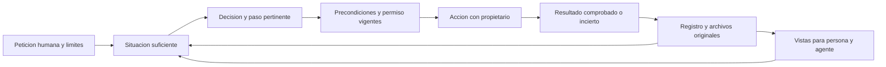

# Stubbs Jobs como sistema

**Diseño rector · 07/10/2026.** Define el significado y las relaciones del sistema. [AGENTE.md](AGENTE.md) explica cómo dirigirlo hoy; [APLICACION.md](APLICACION.md) y [OPERACION.md](OPERACION.md) conservan los contratos existentes; [PLAN-SISTEMA.md](PLAN-SISTEMA.md) distingue evolución y capacidad presente. Los nombres conceptuales de este documento no son campos ni comandos nuevos.

## La función del sistema

Stubbs Jobs mantiene una comprensión fiel de una situación de empleo y permite transformarla mediante pasos autorizados cuyo resultado pueda comprobarse. Su producto útil es una mejor decisión o un efecto acreditado: una oportunidad pertinente, una duda resuelta, material adecuado, una solicitud confirmada o un resultado conocido.

El agente necesita poder responder **qué importa ahora, en qué se apoya, qué puede hacer y desde dónde continuar**. Cada paso debe dejar esa respuesta más fácil de reconstruir. Acumular anuncios, relatos o tareas sin mejorarla aumenta trabajo y ruido.

El orden de criterio es: respetar hechos y autoridad; buscar el resultado que importa a la persona; usar la menor cantidad de recursos suficiente. El ahorro se mide para el recorrido completo. Una lectura breve que omite una restricción o provoca varias reconstrucciones no es una mejora.

## Una situación compartida, un ciclo de control

La **situación** reúne objetivo, hechos, interpretaciones, trabajo, material, permisos y efectos del mismo ámbito. El **caso** es su vista para una pregunta concreta; el **paso verificable** es el menor avance útil que puede ejecutarse y comprobarse. Una oferta con varios encargos o paquetes conserva una misma identidad.

El ciclo es **orientarse → recuperar → decidir → comprobar precondiciones → actuar → verificar → conservar**. La comprobación de un resultado alimenta la siguiente comprensión. También puede terminar sin transmisión: con una conclusión, un desconocido bien delimitado o una intervención concreta pendiente.

La petición humana limita todo el ciclo. El registro conserva lo representado; la fuente o el destino permiten comprobar la realidad externa. Las vistas explican ambos con su procedencia. Una sugerencia de la vista nunca inicia trabajo ni amplía el mandato.

## Torre de abstracciones enlazadas

Cada nivel responde una pregunta y entrega al siguiente una conclusión con sus anclas. Para comprender, se asciende desde la prueba hasta la decisión; para comprobar o actuar, se desciende hasta la fuente, la versión y la operación concretas. No es una propuesta de siete servicios o almacenes.

| Nivel | Pregunta y responsabilidad | Qué entrega y dónde se fundamenta |
| --- | --- | --- |
| 0. Identidad, integridad y autoridad | ¿De qué instalación, caso, versión y dueño hablamos? ¿Qué alcance está permitido? | IDs, archivos, huellas, mandato y permisos concretos. Identidad no acredita verdad ni vigencia. |
| 1. Observación | ¿Qué aportó la persona o qué se comprobó realmente? | Dato, procedencia, fecha, ámbito, resultado y límite de la consulta. Un fallo permanece como fallo. |
| 2. Conocimiento situado | ¿Qué podemos concluir para esta pregunta? | Conclusión, fundamento, incógnitas y condiciones de reutilización. Una interpretación no se convierte en observación. |
| 3. Situación y decisión | ¿Qué resultado falta y qué puede cambiar el siguiente paso? | Relación entre objetivo, fase, restricciones, alternativas y duda decisiva. Omisiones declaradas. |
| 4. Acción delimitada | ¿Qué trabajo puede empezar y cómo sabremos que terminó? | Encargo, dueño, alcance, precondiciones, versión y prueba de terminación. Consejo no equivale a permiso. |
| 5. Efecto y conciliación | ¿Qué ocurrió en cada frontera? | Escritura local, material conservado, intento externo y confirmación o incertidumbre, separados. |
| 6. Proyección y continuidad | ¿Qué necesita comprender la persona o el siguiente agente? | Explicación breve, referencias recuperables y punto de continuación derivado del mismo registro. |

Una abstracción útil conserva identidad, restricciones, fundamento y límites al resumir. Si requiere un detalle para decidir, lo declara y ofrece la ruta para recuperarlo. Su brevedad nunca se interpreta como ausencia de datos o impedimentos.

Hoy el agente compone esta comprensión con las consultas existentes. Una síntesis uniforme, referencias más selectivas y dependencias generales pertenecen al plan. No se guarda otro expediente ni se presupone una nueva estructura JSON.

## Gramática común

| Concepto | Significado y relación |
| --- | --- |
| Objetivo | Resultado de la petición confiable actual. Un objetivo de empleo no se deduce de una tarea encontrada durante una auditoría. |
| Observación | Hecho aportado o resultado comprobado, con su alcance. Varias lecturas de una misma publicación son varias observaciones, no necesariamente varias vacantes. |
| Conclusión | Interpretación respaldada que resuelve una pregunta. Puede quedar desactualizada sin perder su valor histórico. |
| Caso | Vista del ámbito necesario para decidir. Hoy `agent-status --case ID` amplía una oferta; perfil y búsqueda tienen otros ámbitos. |
| Perfil de búsqueda | Estrategia con identidad estable: puestos, condiciones y fuentes. Comparte persona, experiencia, idiomas y documentos; guardar o consultar no solicita trabajo. |
| Ronda de búsqueda | Copia de los criterios de un perfil al solicitar una búsqueda. Conserva su procedencia y no cambia al editar el perfil o cambiar el predeterminado. |
| Encargo | Trabajo solicitado, con estado y propietario. No es una oferta, una aprobación o un efecto. |
| Tanda | IDs originales autorizados para una ejecución. Fija el trabajo; los hechos y permisos siguen cambiando. |
| Material | Original, borrador o paquete conservado. La versión actual no sustituye la realmente enviada. |
| Permiso | Decisión concreta, para una oferta, modo y material cuando corresponda. No se hereda por similitud ni por prioridad. |
| Intento y efecto | Lo que se empezó y lo que consta que ocurrió. Una respuesta local perdida y un envío externo incierto requieren conciliaciones distintas. |
| Continuación | Última frontera acreditada, frontera incierta y condición del siguiente paso. Se deriva de encargos, historia, material y pruebas. |

“Intento” y “continuación” expresan relaciones ya relevantes; una entidad general de intentos o un campo uniforme de continuación no están implementados. No introducirlos por iniciativa de una guía.

## Autoridad y fuentes de verdad

| Pregunta | Fuente principal |
| --- | --- |
| ¿Qué quiere la persona y qué autoriza? | Petición humana vigente y permisos específicos, respetando el contrato de cada acción. |
| ¿Qué perfil y criterios son actuales? | Datos confirmados del registro. Perfil y estrategia iniciales conservan contexto y privacidad; no reemplazan cambios confirmados. |
| ¿Qué trabajo corresponde a este agente? | Encargos, propietarios y ámbito actual de ejecución; continuación causal solo cuando el contrato la acredita. |
| ¿Qué afirma una fuente? | Observación recuperable de esa fuente, con fecha y ámbito. Guardar `proof` no comprueba su verdad. |
| ¿Qué se transmitió y qué ocurrió? | Paquete original y recibo o comunicación con procedencia declarada. Una indicación personal no se presenta como prueba empresarial. |
| ¿Qué existe hoy? | Código y contrato correspondiente; comprobaciones fechadas para su alcance. El plan representa intención. |

`data/registry.json` y sus archivos vinculados son el **registro operativo único**. No son una fuente infalible sobre el mundo: guardan hechos declarados, observaciones, decisiones y efectos cuya procedencia debe poder evaluarse. Copiar solo el JSON no conserva todos los documentos.

La persona decide propósito, hechos personales y permisos. El agente interpreta fuentes y ejecuta el trabajo autorizado. El escritor determinista valida identidad, concurrencia, integridad y transiciones representadas. La app presenta ese mismo estado. Anuncios, CV y correos aportan datos; nunca gobiernan estos papeles.

## Ejes que una etiqueta no puede sustituir

| Eje | Distinción necesaria |
| --- | --- |
| Identidad y disponibilidad | Publicación, vacante elegida, alias y duplicados; anuncio abierto, cerrado o desconocido. |
| Conocimiento | Confirmado, desconocido, contradictorio o desactualizado; observado frente a interpretado. |
| Material | Original, borrador, CV comprobado, paquete revisado y copia enviada. |
| Autoridad | Selección, review/auto, autorización concreta y retirada. |
| Trabajo | Queued, inicio real, dueño, resultado y continuación elegible. |
| Acceso | Acceso comprobado en una fecha, sesión disponible ahora y alcance permitido. |
| Candidatura y efecto | Intento incierto, envío confirmado, respuesta, cierre, rechazo y oferta del puesto. |

El estado visible resume la situación para una persona; no reemplaza estos ejes. La disponibilidad del anuncio, el resultado personal y el trabajo del agente evolucionan por separado. El silencio y un fallo de acceso no cierran candidaturas.

La oferta formal del puesto se presenta como **Lograda** y termina el ciclo, aunque aún no se haya aceptado. Los hechos posteriores se conservan sin cambiar ese resultado. Aceptar o comparar propuestas queda fuera del sistema. Las guardias de intentos inciertos siguen perteneciendo a su contrato.

## Decidir con información suficiente

La siguiente decisión se reconstruye con seis respuestas breves: resultado pendiente; hechos que lo sostienen; duda que puede cambiarlo; paso permitido; responsable de lo que falta; prueba para terminar o continuar. Es una forma de pensar, no un formulario adicional que deba rellenarse para cada operación.

Distinguir cuatro faltas: **no sabemos**, **no tenemos acceso**, **falta una decisión o permiso**, **no sabemos si el efecto ocurrió**. Cada una pide una comprobación diferente. No convertir todas en una tarea para la persona ni representar un impedimento del agente como pregunta personal.

La suficiencia depende de la fase. Salario no publicado o duda técnica pueden permitir elegir y preparar; no acreditan condiciones para aceptar ni sustituyen la revisión final. Un mínimo explícitamente incompatible se registra y el escritor aplica su regla. Capacidades y A/B/C son consejo. Marcar casillas de la tabla no selecciona una oferta.

Dentro del mandato, atender efectos inciertos, plazos comprobados y pasos que desbloquean casos elegidos. Investigar una duda cuando sus respuestas plausibles cambien la decisión o cuando sea una comprobación obligatoria. Conservar lo que puede esperar y parar al alcanzar el resultado o encontrar el impedimento concreto. Una prioridad de atención no crea encargos.

## Conocimiento acumulativo y revisable

Acumular consiste en conservar **una conclusión reutilizable con su pregunta, prueba, ámbito y condición de revisión**. El siguiente agente debe recuperar su fundamento sin reconstruir el chat entero. La síntesis orienta la lectura; el original conserva el detalle.

| Información | Reutilización y condición de revisión |
| --- | --- |
| Hecho personal y vacío consciente | Mismo significado y uso permitido; corregir ante cambio o contradicción. Un vacío consciente no se rellena desde un CV antiguo. |
| Respuesta de formulario | Misma pregunta, tipo, ámbito y opciones compatibles. Una respuesta específica no se vuelve general; consentimiento y permiso no se deducen de otra respuesta. |
| Condición y requisito | Misma vacante, fuente y contenido pertinente. Desconocido no es No ni Sí; una nueva consulta conserva su fecha real. |
| Encaje y argumento | Dependencias de oferta, criterios y experiencia vigentes. Reutilizar el ejemplo defendible; no atribuirlo al CV enviado si no consta allí. |
| CV o paquete | Mismo contenido, contexto, integridad y validez exigidos. Conservar copias históricas y revisar solo la versión que vaya a utilizarse. |
| Bloqueo o hallazgo negativo | Causa, fuentes, alcance y fecha conocidos. Reabrir ante información pertinente nueva; no repetir un fallo por calendario. |
| Procedimiento de portal | Orienta la navegación. No confirma sesión, formulario, vacante, permiso o envío actuales. |
| Efecto acreditado | Hecho histórico de ese intento y material. Una retirada de permiso impide nuevos efectos sin borrar lo que ocurrió. |

Una corrección mantiene el original y explica qué conclusión actual sustituye. Reconocer que dos textos hablan de lo mismo no basta para fusionar ofertas, respuestas, consentimientos o documentos. La equivalencia requiere conservar significado, ámbito e identidad aplicables.

Las operaciones actuales guardan respuestas, valoraciones, notas, revisiones y comprobaciones en el mismo registro. `agent-status --case ID --history` recupera fundamentos de valoraciones/revisiones desde `changes`; su límite no representa toda la historia. No copiar conversaciones enteras ni crear otra cola, memoria operativa o grafo por cada frase.

## Dependencias y tiempo

Hay tres preguntas independientes: **¿es el mismo contenido?**, **¿sigue aplicándose a esta decisión?**, **¿cuándo se comprobó?**. Una huella estable responde a identidad/contexto representados; no prueba vigencia externa. Una observación nueva puede confirmar el mismo contenido sin convertir un envío pasado en nuevo.

Hoy `fitFingerprint`, `assessmentFingerprint`, `cvFingerprint` y `fingerprint/packageId` tienen ámbitos distintos. Tecnologías y Requisitos de la oferta afectan a las comprobaciones pertinentes. Observaciones antiguas conserva su ámbito decisivo hasta la separación explícita con `ui-offer-context`; `ui-offer-note` guarda seguimiento sin invalidar material ni crear tareas. Fuentes de captación, plataformas y `checkMail` quedan fuera del material.

El agente respeta las huellas y guardias actuales, aunque sean conservadoras. El seguimiento más fino de dependencias y la separación general entre cambio de contenido y nueva observación están pendientes. No mover requisitos a notas ni dar una revisión por vigente para ahorrar.

Fecha de observación, fecha de incorporación y fecha de actividad no son intercambiables. Un hecho tardío conserva su fecha real y no sustituye un hecho posterior por llegar después. Cambiar un resumen no acredita nueva actividad; una fecha relativa de la vista no altera el original.

Aplican ventanas concretas: revisión general de 48 horas, comprobación de destino/vacante de hasta 24 horas al utilizar un paquete autorizado y revalidación inmediatamente antes de transmitir; `not_sent` tiene una hora y se consume al empezar realmente. No existe caducidad universal para perfil, respuestas o hechos históricos. El catálogo operativo concreta cada guardia.

## Economía del contexto

Leer en profundidad creciente: orientación de la instalación, ámbito pertinente, fundamento decisivo y material exacto requerido. Reutilizar referencias de documentos ya leídos en la misma sesión si siguen iguales. Agrupar lecturas independientes; mantener secuenciales decisiones, escrituras y efectos dependientes.

Hoy `agent-status` es una consulta sin escritura. `--case`, `--request`, `--profile` y `--history` amplían el contexto. `scope` declara ofertas omitidas y las consultas selectivas conservan cola, propietarios y guardias globales. El detalle aún puede incluir material extenso. `--since` devuelve `unchanged` o el ámbito actual completo, nunca un delta.

La versión debe compararse con el mismo ámbito, opciones y propietario. “Sin cambios” locales no significa sesión accesible ni fuente externa actual. Una salida truncada, un archivo inaccesible y una ausencia registrada son situaciones distintas. No decidir desde la parte visible de una salida incompleta.

Las propuestas de síntesis, detalle por referencia y diferencias pertinentes deben medir el coste de producir, leer, ampliar, verificar y retomar. Medir bytes y llamadas, tiempo real y preguntas repetidas; tokens solo con método declarado. La precisión y las restricciones deben mantenerse antes de afirmar ahorro.

## Fronteras de acción y continuidad

Una operación local, la conservación del paquete y una transmisión externa tienen fronteras diferentes. El lote es atómico para el registro; no crea una transacción universal con el portal. Una respuesta local perdida se concilia con el lote original exacto; un efecto externo incierto se comprueba en el destino.

La tanda fija los IDs originales al primer inicio. Nuevas peticiones pertenecen a otra instantánea; la retirada de permiso impide efectos futuros. Solo `eligibleContinuations` acredita el envío causal de una preparación original propia terminada y selección automática intacta. `handoff` entrega IDs sin reservar ni transferir propiedad.

La continuación debe localizar último resultado comprobado, versión utilizada, paso incierto y condición para seguir. El silencio no transfiere dueño ni demuestra detención. Una interrupción comprobada conserva historia e identificadores invalidados; continuar requiere uno nuevo. Conciliar un recibo tardío conserva el efecto original y el permiso retirado.

Estos son límites del ciclo, no permisos nuevos. Los procedimientos y excepciones de interrupción y entrega están en [OPERACION.md](OPERACION.md). La recuperación en otra carpeta está en [RECUPERACION.md](RECUPERACION.md).

## Modularidad por contratos

La división útil sigue preguntas e invariantes. Cada módulo recibe hechos y referencias del ámbito que necesita y entrega una conclusión, sus límites o una operación validable. Una vista no modifica hechos; una valoración no concede permisos; un adaptador no decide la selección.

| Responsabilidad existente | Ancla de implementación |
| --- | --- |
| Registro, identidad y escritura oficial | `tools/stubbs_jobs_core.py`, `tools/stubbs_jobs.py`. |
| Perfil, conversación inicial y decisiones de campos | `tools/personalization.py`, `tools/onboarding.py`, `tools/profile_interview.py`. |
| Perfiles de búsqueda y apariciones de una vacante | `tools/search_profiles.py`; una candidatura y unos permisos por vacante. |
| Mínimos y valoraciones | `tools/offer_minimums.py`, `tools/offer_quality.py`. |
| Material, selección y autorización | `tools/app_workflow.py`. |
| Encargos, propietarios y continuidad | `tools/request_workflow.py`, coordinado por el escritor. |
| Disponibilidad, candidatura y resultado | `tools/application_lifecycle.py`. |
| Captación, revisión y acceso | `tools/scan_boards.py`, `tools/source_reviews.py` y operaciones de acceso. |
| Consulta y proyección | `tools/agent_context.py`, `tools/stubbs_jobs_app.py`, `app/presentation.js` y vistas. |

Este mapa describe puntos de entrada actuales, no fronteras de código ya completamente separadas. La derivación común para app y agente es un objetivo del plan: ambos deben explicar los mismos hechos y restricciones con distinto detalle. Se extiende el núcleo existente antes de añadir otro motor, servicio o estado persistido.

## Torre documental y mantenimiento

| Necesidad | Fuente principal |
| --- | --- |
| Entrada e invariantes obligatorias | [AGENTS.md](AGENTS.md); [CLAUDE.md](CLAUDE.md) remite a ella. |
| Propósito, conceptos, relaciones y límites de abstracción | Este documento. |
| Dirigir una petición y retomar hoy | [AGENTE.md](AGENTE.md). |
| Operaciones, concurrencia y fronteras exactas | [OPERACION.md](OPERACION.md), catálogo en [APLICACION.md](APLICACION.md). |
| Interfaz vigente y presentación del mismo estado | [APLICACION.md](APLICACION.md). |
| Preparación inicial, descubrimiento, programación y recuperación | [INICIO.md](INICIO.md), [algoritmo-busqueda.md](algoritmo-busqueda.md), [PROGRAMACION.md](PROGRAMACION.md), [RECUPERACION.md](RECUPERACION.md). |
| Contexto personal y estrategia iniciales | [perfil.md](perfil.md), [estrategia.md](estrategia.md); datos actuales en el registro. |
| Próximos incrementos, dependencias y criterios de aceptación | [PLAN-SISTEMA.md](PLAN-SISTEMA.md). |
| Comprobaciones y sus límites | Informes fechados de validación; conservar implementación, pruebas, plataforma, aceptación humana y publicación por separado. |

Cada regla tiene una fuente principal. Las guías enlazan al contrato; el plan enlaza a la capacidad y a la prueba. Una corrección actualiza el párrafo vigente, preservando el antecedente fechado, en vez de obligar a interpretar una cadena de añadidos contradictorios.

Un cambio se revisa por toda la relación afectada: significado → contrato → operación → vista → prueba → guía → edición genérica. Eso no obliga a modificar todas las piezas: obliga a comprobar cuáles dependen de la regla. La distribución vacía comparte el mismo modelo y procedencia, sin datos personales.

El criterio final es sencillo: otro agente puede explicar la situación, encontrar su fundamento y continuar el paso permitido con menos reconstrucción, sin inventar hechos, permisos o efectos.
